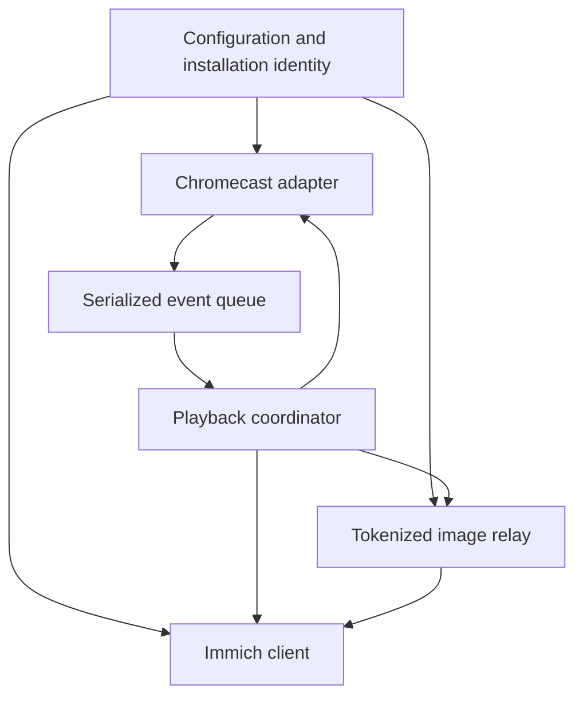
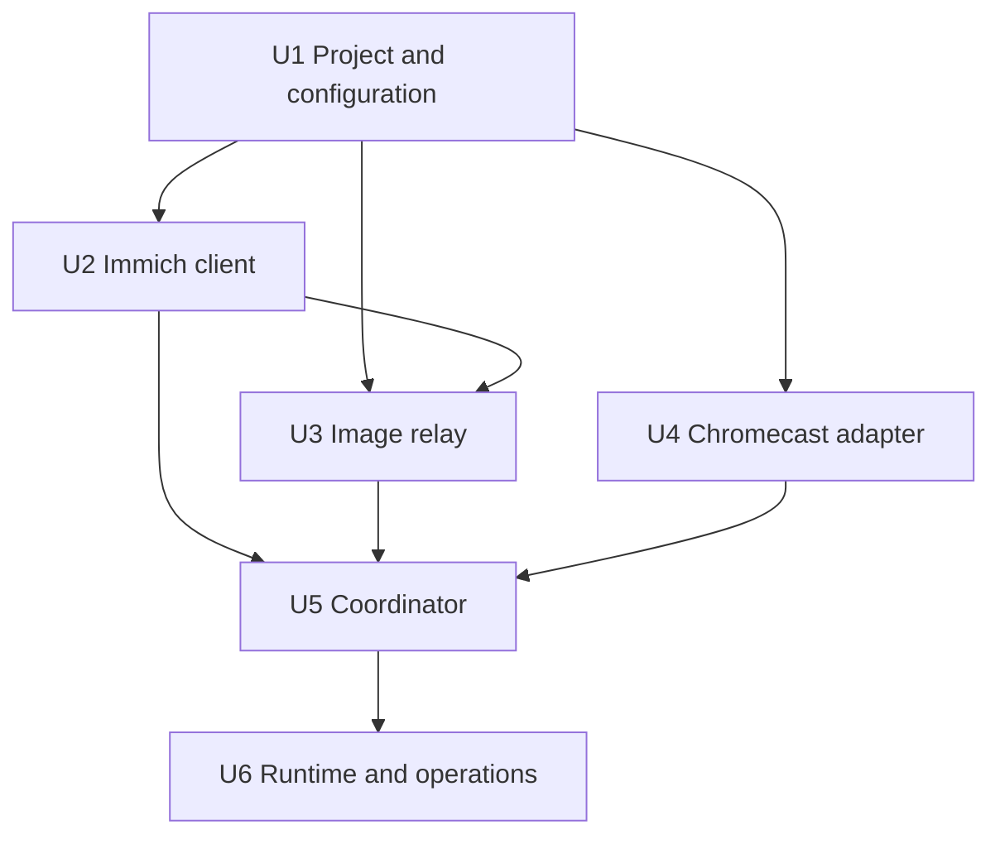

# feat: Add Immich Chromecast photo rotation

## Summary

Build a Python 3.11+ background service that monitors one Chromecast and displays random Immich timeline photos whenever the receiver is confidently idle. The service uses conservative session ownership detection, an authenticated image relay, and a serialized state machine so it yields to external playback and recovers safely from failures.

---

## Problem Frame

Immich can supply the photos and Chromecast can display them, but protected Immich assets cannot be loaded directly by a Chromecast without exposing credentials. The service must also distinguish its own rotation from another sender's media so automatic casting never deliberately replaces externally owned playback.

---

## Requirements

- R1. Read the Immich URL, API key, Chromecast UUID, relay address, rotation interval, and timeout settings from validated configuration.
- R2. Select random timeline `IMAGE` assets visible to the API-key user, excluding archived, hidden, deleted, offline, and locked assets.
- R3. Continuously discover and reconnect to the configured Chromecast.
- R4. Cast only when the receiver is confirmed idle or positively running this service's media.
- R5. Treat external `PLAYING`, `BUFFERING`, and `PAUSED` media and unknown applications as protected.
- R6. Advance photos at a configurable interval measured from confirmed display.
- R7. Relay authenticated Immich previews through opaque, expiring LAN URLs without exposing the API key.
- R8. Handle Immich outages, Chromecast disconnects, process restarts, stale callbacks, and failed loads without command loops.
- R9. Provide structured redacted logs, graceful shutdown, installation documentation, and automated tests.

---

## Scope Boundaries

- Support one Immich server and one Chromecast.
- Support images only; video and audio are excluded.
- Use timeline photos only. Shared-album-only and locked assets are unavailable through this selection flow.
- Do not build a web UI, remote management API, or multi-device coordinator.
- Do not automatically stop, pause, or quit external applications.
- Treat non-interruption as a best-effort safety property because Chromecast has no atomic "load only if still idle" operation.
- Defer container packaging until needed; document host networking requirements so a future container deployment does not break mDNS or relay reachability.

---

## Context & Research

### Relevant Code and Patterns

- The repository is empty, with no existing source, tests, packaging, or project conventions.
- The implementation should use a small adapter-driven structure with one coordinator owning all mutable playback state.
- PyChromecast callbacks occur on worker threads and should enqueue immutable events instead of mutating coordinator state.

### Institutional Learnings

- No `docs/solutions/` content or other institutional guidance exists in the repository.

### External References

- Immich v3.0.3 exposes stable random image search through `POST /api/search/random` and preview retrieval through `GET /api/assets/{id}/thumbnail`.
- PyChromecast 14.0.10 requires Python 3.11+ and supplies discovery, receiver status, media status, connection status, and load-failure listeners.
- Google Cast receivers fetch media themselves, so the relay URL must contain an address reachable from the Chromecast rather than loopback or an isolated container address.

---

## Key Technical Decisions

- Target Python 3.11+ and initially pin PyChromecast 14.0.10 because receiver behavior is central to the service's safety policy.
- Use `aiohttp` for both Immich requests and the LAN image relay to keep network I/O in one asynchronous runtime.
- Use Immich random search with explicit image, timeline visibility, offline, and deleted filters. Request preview renditions using only `asset.read` and `asset.view` permissions.
- Require a Chromecast UUID as the stable identifier. Friendly-name lookup may assist setup but must reject ambiguous matches.
- Put every PyChromecast callback onto one asynchronous event queue. One coordinator serializes Cast commands and owns connection, ownership, and timer state.
- Mark loaded media with versioned `customData`, a persistent installation ID, and a unique load ID. App ID alone never proves ownership.
- Require fresh receiver and media status before acting. Treat paused media as protected, including media originally loaded by this service.
- Use a bounded recent-asset history to reduce immediate repeats without creating an unbounded local database.
- Bind the relay separately from its advertised address so the Chromecast receives a LAN-reachable URL.
- Use at least 128 bits of entropy for asset-bound relay tokens and permit token replay until expiry for receiver retries.
- Leave current media untouched during shutdown. Never send a compensating stop after a takeover race because it could stop newly started user media.

---

## Open Questions

### Resolved During Planning

- Which assets are eligible: normal timeline images across the API-key user's own and timeline-shared partner assets; archived, hidden, offline, deleted, and locked assets are excluded.
- How protected assets reach Chromecast: a narrow tokenized LAN relay fetches previews using the API key.
- What counts as occupied: external playing, buffering, paused, and unknown application states are protected.
- How restarts recover ownership: a persistent installation identity is included in versioned media ownership metadata.
- What shutdown does to displayed media: it leaves the receiver untouched.

### Deferred to Implementation

- Confirm exact idle and Backdrop status combinations on the target Chromecast model. Unknown combinations must remain protected until validated.
- Verify whether the target receiver sends `HEAD` or byte-range requests. Start with explicit `GET` and `HEAD` behavior and add range handling only if hardware validation requires it.
- Tune idle debounce, load timeout, relay token lifetime, and recent-history defaults through hardware testing.

---

## Output Structure

```text
pyproject.toml
README.md
config.example.toml
.gitignore
src/cast_immich/
    __init__.py
    __main__.py
    app.py
    config.py
    immich.py
    relay.py
    cast.py
    coordinator.py
tests/
    conftest.py
    test_config.py
    test_immich.py
    test_relay.py
    test_cast.py
    test_coordinator.py
    test_app.py
    hardware/
        test_chromecast_smoke.py
.github/workflows/ci.yml
```

---

## High-Level Technical Design

> *This illustrates the intended approach and is directional guidance for review, not implementation specification. The implementing agent should treat it as context, not code to reproduce.*



The coordinator uses the following conservative lifecycle:

```text
UNAVAILABLE -> SYNCHRONIZING -> IDLE_CANDIDATE -> LOAD_PENDING -> OWNED
                        |              |              |
                        +----------> PROTECTED <------+
```

Any disconnect invalidates in-flight work. Any unknown or externally owned state moves to `PROTECTED`. Re-entry from `PROTECTED` requires a fresh, stable idle observation.

---

## Implementation Units



### U1. Project and Configuration

**Goal:** Establish the package, validated TOML configuration, logging, and persistent installation identity.

**Requirements:** R1, R8, R9

**Dependencies:** None

**Files:**
- Create: `pyproject.toml`
- Create: `config.example.toml`
- Create: `src/cast_immich/__init__.py`
- Create: `src/cast_immich/config.py`
- Test: `tests/test_config.py`

**Approach:**
- Define Python and dependency constraints, package metadata, test configuration, linting, and type-checking in `pyproject.toml`.
- Validate URLs, UUIDs, ports, positive intervals, token lifetime, and timeout ranges.
- Keep API keys out of command-line arguments and logs while allowing an environment-variable secret override.
- Generate and atomically persist a non-secret installation UUID when one is absent.
- Use monotonic time for operational deadlines and UTC wall time only for diagnostics.

**Execution note:** Implement configuration validation test-first because invalid network identity can otherwise produce unsafe or confusing runtime behavior.

**Patterns to follow:**
- Use typed immutable settings and explicit validation rather than passing unstructured dictionaries.
- Keep configuration loading separate from process startup so tests do not depend on global environment state.

**Test scenarios:**
- Happy path: valid TOML produces normalized settings for Immich, Chromecast, relay, and rotation behavior.
- Error path: missing Immich URL, API key, Chromecast UUID, or advertised relay address fails with a clear diagnostic.
- Edge case: invalid ports, non-positive intervals, malformed UUIDs, and loopback advertised addresses are rejected.
- Error path: API keys are redacted from validation errors and logging.
- Integration: installation identity remains stable when configuration is loaded across process restarts.

**Verification:**
- A valid example configuration loads without warnings, invalid configuration exits before network clients start, and no secret is emitted in diagnostics.

### U2. Immich Asset Client

**Goal:** Select eligible photos and fetch their preview bytes through authenticated Immich API calls.

**Requirements:** R2, R6, R8

**Dependencies:** U1

**Files:**
- Create: `src/cast_immich/immich.py`
- Test: `tests/test_immich.py`

**Approach:**
- Call `/api/search/random` with explicit image and timeline filters.
- Retrieve `/api/assets/{id}/thumbnail?size=preview` with `x-api-key` authentication.
- Select from a bounded candidate batch while excluding recently displayed IDs.
- Apply request timeouts and bounded exponential backoff with jitter only to transient failures.
- Treat confirmed authentication, permission, and incompatible-contract failures as permanent configuration errors.
- Fail closed on malformed or uncertain asset eligibility.

**Patterns to follow:**
- Return typed domain outcomes rather than leaking raw HTTP responses into the coordinator.
- Keep retry policy at the network boundary and cancellation-aware.

**Test scenarios:**
- Happy path: an eligible timeline image is selected and its preview is fetched with `x-api-key`.
- Edge case: videos and archived, hidden, deleted, offline, or locked assets are never selected.
- Edge case: repeated candidates are skipped until bounded attempts are exhausted.
- Edge case: empty results enter cooldown rather than causing rapid repeated requests.
- Error path: `401` and `403` produce a permanent configuration or permission error.
- Error path: `429`, timeout, malformed JSON, and `5xx` responses follow the defined retry or failure policy.
- Integration: an asset disappearing between selection and preview retrieval is skipped without reaching the Cast adapter.

**Verification:**
- Mock-server contract tests prove the request shape, filters, authentication header, response validation, and retry boundaries.

### U3. Protected Image Relay

**Goal:** Serve selected previews to Chromecast without exposing Immich credentials.

**Requirements:** R7, R8

**Dependencies:** U1, U2

**Files:**
- Create: `src/cast_immich/relay.py`
- Test: `tests/test_relay.py`

**Approach:**
- Mint opaque tokens mapped internally to one asset and preview variant.
- Support `GET` and `HEAD` and reject unsupported methods.
- Preserve allowlisted image MIME types and provide permissive CORS headers for receiver compatibility.
- Never accept arbitrary upstream URLs or redirect the receiver to Immich.
- Expire tokens and bound upstream time, response size, and concurrent requests.
- Redact token-bearing paths from access and exception logs.

**Patterns to follow:**
- Treat the token table as a bounded capability store rather than a general-purpose proxy cache.
- Stream validated responses and close upstream requests promptly when the receiver disconnects.

**Test scenarios:**
- Happy path: a valid token returns the bound preview and accurate MIME type.
- Integration: API keys and authorization headers are sent upstream but never appear downstream.
- Error path: unknown, expired, tampered, and asset-mismatched tokens are rejected.
- Error path: non-image responses, oversized bodies, timeouts, and upstream failures produce safe responses.
- Edge case: concurrent receiver retries can reuse a token until expiry without mapping it to another asset.
- Edge case: `HEAD`, `GET`, and unsupported methods have explicit behavior.
- Integration: client disconnect and service shutdown release active upstream requests.

**Verification:**
- A real local relay backed by a mock Immich server streams an image successfully while logs and responses remain credential- and token-safe.

### U4. Chromecast Adapter

**Goal:** Encapsulate discovery, status normalization, media loading, and threaded callbacks.

**Requirements:** R3, R4, R5, R8

**Dependencies:** U1

**Files:**
- Create: `src/cast_immich/cast.py`
- Test: `tests/test_cast.py`
- Test: `tests/hardware/test_chromecast_smoke.py`

**Approach:**
- Discover by UUID through PyChromecast and keep discovery active for address changes.
- Normalize receiver, media, connection, and load-failure callbacks into immutable coordinator events.
- Attach a connection generation to events so callbacks from replaced connections can be ignored.
- Load images as buffered media with the actual MIME type and versioned ownership `customData`.
- Confirm loads through media status rather than assuming the command call succeeded.
- Do not expose general automatic `stop` or `quit_app` operations to the coordinator.

**Patterns to follow:**
- Listener callbacks should enqueue and return quickly; they must not perform blocking HTTP or mutate coordinator state.
- Treat each explicitly disconnected Chromecast object and its listeners as disposable.

**Test scenarios:**
- Happy path: the configured UUID is selected while other discovered devices are ignored.
- Integration: connection loss and address changes emit normalized events with the correct generation.
- Edge case: threaded, duplicated, delayed, and out-of-order callbacks remain safe.
- Happy path: media load uses a buffered stream and includes the expected ownership metadata.
- Edge case: Default Media Receiver content without matching metadata is classified as external.
- Error path: load failure and confirmation timeout are reported without blind retries.
- Hardware: opt-in testing verifies UUID discovery and image loading from the LAN relay.

**Verification:**
- Fake-controller tests prove callback normalization and command payloads; an opt-in hardware smoke test proves discovery and relay reachability.

### U5. Ownership-Aware Coordinator

**Goal:** Implement the safety-critical state machine and photo rotation.

**Requirements:** R3, R4, R5, R6, R8

**Dependencies:** U2, U3, U4

**Files:**
- Create: `src/cast_immich/coordinator.py`
- Test: `tests/test_coordinator.py`

**Approach:**
- Keep all mutable playback state in one asynchronous coordinator.
- Require a complete, fresh status snapshot and stable-idle debounce before loading.
- Recheck connection generation and ownership immediately before every command.
- Establish ownership only after matching installation ID, load ID, content URL, and current media status are observed.
- Cancel timers and discard asynchronous results whenever the connection generation changes.
- On takeover, issue no compensating stop because it could affect newly started external media.
- After reconnect or restart, observe first and reclaim ownership only from valid persistent markers.
- Start each rotation interval only after the expected media status confirms display.

**Execution note:** Implement the state transition table test-first; the negative assertion that no Cast command is emitted is the core safety property.

**Patterns to follow:**
- Model uncertain state conservatively: uncertainty always transitions to synchronization or protection, never directly to loading.
- Allow at most one in-flight asset selection or Cast command for the current generation.

**Test scenarios:**
- Happy path: stable idle state sends exactly one load.
- Happy path: owned rotation advances only after the interval and a final ownership check.
- Safety: external playing, buffering, paused, or unknown app state sends no command.
- Race: a transient idle callback followed by external activity cancels the pending load.
- Race: external takeover during selection discards the selected asset.
- Race: takeover after load transmission produces no stop or second load.
- Recovery: disconnect invalidates cached state and requires fresh synchronization.
- Recovery: restart safely recognizes matching persistent ownership metadata.
- Edge case: mismatched or malformed ownership metadata is treated as external.
- Error path: load timeout enters cooldown without command spam.
- Edge case: reversed, duplicate, and stale events never create duplicate loads.

**Verification:**
- The transition suite asserts both resulting state and emitted commands for every permitted and protected state, including explicit no-command assertions.

### U6. Runtime and Operations

**Goal:** Assemble the service lifecycle and document deployment requirements.

**Requirements:** R1, R3, R8, R9

**Dependencies:** U1, U2, U3, U4, U5

**Files:**
- Create: `src/cast_immich/app.py`
- Create: `src/cast_immich/__main__.py`
- Create: `tests/conftest.py`
- Create: `tests/test_app.py`
- Create: `README.md`
- Create: `.gitignore`
- Create: `.github/workflows/ci.yml`

**Approach:**
- Start configuration, relay, Immich client, discovery, and coordinator in dependency order.
- Exit for invalid configuration or confirmed permission failures.
- Remain alive with bounded backoff during transient Immich or Chromecast outages.
- Handle `SIGINT` and `SIGTERM`, stop scheduling commands, drain briefly, and close resources.
- Document same-subnet multicast requirements, relay TCP access, firewall rules, API-key permissions, and installation identity persistence.
- Recommend host deployment or Docker host networking without adding container artifacts in the initial scope.
- Run unit and mock integration tests in CI while keeping physical Chromecast tests opt-in.

**Patterns to follow:**
- Use structured state-transition logs with reason codes while redacting credentials and relay tokens.
- Make cleanup idempotent so partial startup and repeated shutdown signals remain safe.

**Test scenarios:**
- Integration: Chromecast absent at startup can appear later without restarting the service.
- Integration: temporary Immich outage keeps monitoring alive with bounded backoff.
- Error path: permanent credential failure exits safely.
- Error path: relay bind failure prevents partial startup.
- Integration: shutdown during discovery, selection, load, or relay streaming issues no new Cast command.
- Integration: shutdown leaves displayed media untouched and closes discovery, Cast, HTTP, and relay resources.

**Verification:**
- The packaged entry point starts from example configuration, exposes actionable state logs, handles termination within its shutdown deadline, and passes CI without hardware access.

---

## System-Wide Impact

- **Interaction graph:** PyChromecast worker threads feed one event queue; the coordinator calls the Immich client, relay capability store, and Cast adapter.
- **Error propagation:** Network adapters translate raw failures into permanent, transient, skipped-asset, or synchronization outcomes consumed by the coordinator.
- **State lifecycle risks:** Every asynchronous result is scoped to a connection generation; relay tokens and recent-asset history remain bounded in memory.
- **API surface parity:** The initial service has only a package entry point and file configuration; no additional public API requires parity.
- **Integration coverage:** Mock Immich and Cast adapters cover CI; real discovery, receiver status, and LAN fetching require opt-in hardware validation.
- **Unchanged invariants:** The service never modifies Immich assets and never deliberately controls media it cannot positively identify as its own.

---

## Risks & Dependencies

| Risk | Mitigation |
|------|------------|
| External playback begins between the final check and `LOAD` | Minimize the window with debounce, fresh status, generation checks, and one in-flight command; document the unavoidable race. |
| Receiver firmware changes status behavior | Pin PyChromecast, normalize conservatively, and retain opt-in hardware tests. |
| Chromecast cannot reach the relay | Require an explicit advertised LAN address and document VLAN, firewall, and host-network requirements. |
| Immich changes its API contract | Contract-test request and response shapes against the supported Immich major version. |
| Ownership is falsely attributed | Require versioned installation and load markers plus current content and session correlation. |
| Stale relay URLs expose images | Use high-entropy, asset-bound, short-lived tokens and redacted logs. |
| A small library causes frequent repetition | Use bounded recent history and eventually permit repeats rather than looping indefinitely. |
| Ordinary container networking breaks mDNS | Keep containers outside the initial deliverable and document host networking for future packaging. |

---

## Documentation / Operational Notes

- Document minimum Immich API-key permissions: `asset.read` and `asset.view`.
- Explain that random search covers the API-key user's timeline and timeline-shared partner assets, not locked or shared-album-only assets.
- Explain how to identify and configure the Chromecast UUID.
- Distinguish relay bind address from the address advertised to Chromecast.
- Document mDNS UDP 5353, Cast control connectivity, relay port access, same-subnet expectations, and Wi-Fi client-isolation constraints.
- Document the conservative ownership policy, especially that paused or unknown media remains protected.
- Provide an opt-in hardware test procedure and a troubleshooting checklist for discovery and relay reachability.

---

## Sources & References

- Immich v3.0.3 OpenAPI: https://github.com/immich-app/immich/blob/v3.0.3/open-api/immich-openapi-specs.json
- Immich casting documentation: https://immich.app/docs/features/casting/
- PyChromecast 14.0.10: https://github.com/home-assistant-libs/pychromecast/tree/14.0.10
- Google Cast media requirements: https://developers.google.com/cast/docs/media
- Google Cast media messages: https://developers.google.com/cast/docs/media/messages
- Google Cast discovery requirements: https://developers.google.com/cast/docs/discovery
