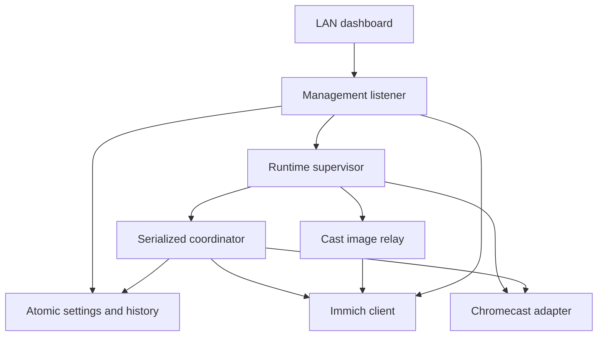
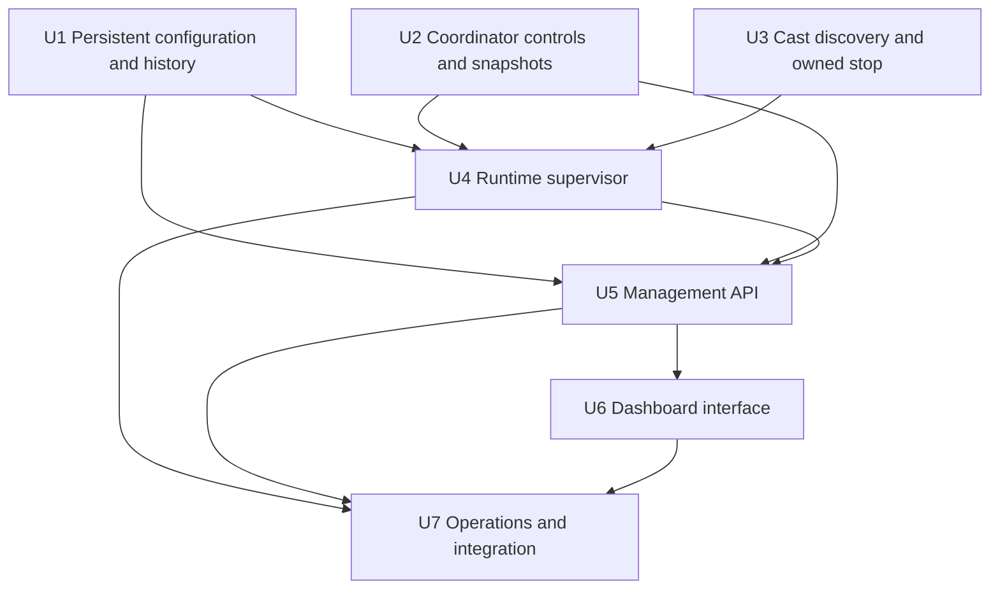
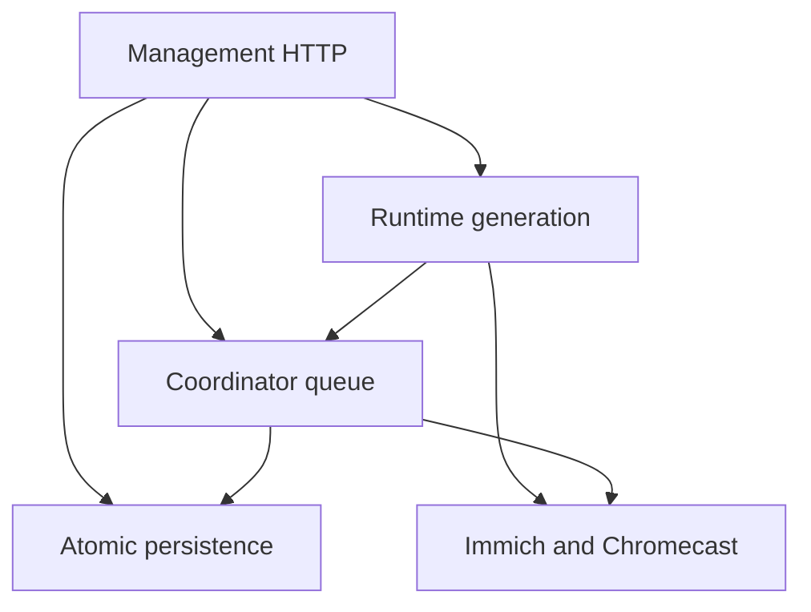

# feat: Add web control dashboard

## Summary

Add a stable management listener, transactional runtime supervisor, serialized playback commands, bounded durable history, and a packaged no-build dashboard while preserving the coordinator's conservative ownership policy.

---

## Problem Frame

The current service is composed once from a valid TOML file and can only be operated through host access. Its private coordinator state, UUID-filtered discovery, in-memory recent IDs, and relay-specific bearer URLs do not provide safe seams for browser configuration or control (see origin: `docs/brainstorms/2026-07-17-web-control-dashboard-requirements.md`).

---

## Requirements

- R1. Serve a responsive trusted-LAN dashboard from a stable management listener that remains available in setup mode and during relay reconfiguration.
- R2. Publish sanitized service, ownership, configuration, discovery, operation, and error status without returning API keys or relay tokens.
- R3. Discover all available Chromecasts for selection while retaining UUID as the active identity.
- R4. Edit all existing operator-facing configuration values, with the API key represented as write-only replacement input.
- R5. Validate the complete candidate, preserve blank secrets, reject stale revisions, persist atomically, and activate only after safe staging succeeds.
- R6. Apply valid settings without a process restart and leave external playback untouched through reconfiguration.
- R7. Serialize pause, enable, next, reconnect, and owned-only stop through authoritative runtime/coordinator boundaries.
- R8. Require fresh positive ownership immediately before next or stop and emit no media command for protected or uncertain states.
- R9. Persist rotation pause state and cancel unsent automatic work without compensating for already transmitted loads.
- R10. Persist exactly the latest 10 confirmed display events, separately from the configurable repeat-exclusion window.
- R11. Serve recent thumbnails through same-origin history routes without exposing Immich credentials, arbitrary asset access, or Cast capabilities.
- R12. Preserve headless background behavior, graceful shutdown, bounded retries, structured redacted logs, and desktop/mobile usability.

**Origin actors:** A1 (LAN operator), A2 (casting service), A3 (Chromecast), A4 (Immich)

**Origin flows:** F1 (configure and select receiver), F2 (control rotation), F3 (review recent displays)

**Origin acceptance examples:** AE1-AE8 from `docs/brainstorms/2026-07-17-web-control-dashboard-requirements.md`

---

## Scope Boundaries

- Keep one active Chromecast; broad discovery is read-only and does not create a multi-device coordinator.
- Do not add login, accounts, roles, TLS termination, permissive management CORS, or public-internet support.
- Do not expose arbitrary Cast commands, arbitrary Immich asset retrieval, the persisted API key, or reusable Cast relay URLs.
- Do not stop paused, external, stale, unknown, or ambiguously owned playback.
- Keep durable display history fixed at 10 rather than creating a searchable or unbounded archive.
- Keep the management listener a startup/deployment setting rather than allowing it to disconnect its own save request.

---

## Context & Research

### Relevant Code and Patterns

- `src/cast_immich/coordinator.py` is the sole mutable playback owner; new controls must use immutable queue events, generation checks, fresh status, and explicit no-command refusals.
- `src/cast_immich/app.py` owns dependency-ordered startup and idempotent cleanup but currently fixes every component for process lifetime.
- `src/cast_immich/config.py` provides frozen settings and validation; parsing must be separated from installation-identity side effects before web saves.
- `src/cast_immich/relay.py` demonstrates bounded image validation but its Cast capability URLs must remain separate from browser thumbnails.
- `tests/test_coordinator.py` uses fake adapters and deterministic queue events for positive and negative command assertions.
- `tests/conftest.py` provides local aiohttp test-server coverage without adding a browser framework dependency.

### Institutional Learnings

- No `docs/solutions/` directory exists. The completed rotation plan establishes conservative uncertainty handling, generation-scoped asynchronous work, bounded in-memory capabilities, and redacted logs as invariants.

### External References

- aiohttp application lifecycle and runners: https://docs.aiohttp.org/en/stable/web_advanced.html
- aiohttp server request limits: https://docs.aiohttp.org/en/stable/web_reference.html
- OWASP CSRF prevention guidance: https://cheatsheetseries.owasp.org/cheatsheets/Cross-Site_Request_Forgery_Prevention_Cheat_Sheet.html

---

## Key Technical Decisions

- Serve management and Cast relay traffic on separate listeners. Relay bind changes cannot remove access to setup, status, or rollback.
- Use CLI/environment bootstrap values for management bind host and port, defaulting to loopback. Explicit LAN binding is required for other devices and documented as unauthenticated trusted-LAN access.
- Keep atomic TOML as the settings source of truth and use a separate permission-restricted atomic JSON file for fixed-capacity history and persisted rotation-enabled state. This avoids introducing a database for 10 records and preserves existing operator workflows.
- Treat `CAST_IMMICH_API_KEY` as environment-managed and non-replaceable from the browser while present; a saved file key remains dormant rather than being reported as active.
- Introduce a runtime supervisor that serializes saves and component replacement. It stages fallible resources, writes a complete candidate atomically, commits one active runtime generation, and restores the previous persisted/runtime snapshot on failure.
- Reuse active components when their listener identity is unchanged. Relay endpoint changes stage a new listener when possible and retain the replaced relay for its remaining token lifetime; same-endpoint policy changes avoid rebinding.
- Expose immutable sanitized snapshots and command result enums. Browser-rendered state is informational; execution-time coordinator state remains authoritative.
- Use revision-based optimistic concurrency and same-origin JSON mutation protection with a process CSRF token, strict request-size limits, no management CORS, and defensive response headers.
- Use a packaged no-build HTML/CSS/JavaScript application with polling. The project remains Python-only and needs no Node toolchain.
- Fetch browser thumbnails by opaque history event ID through the current authenticated Immich boundary. Only records still in the latest-ten store are addressable.

---

## Open Questions

### Resolved During Planning

- **Configuration and history store:** Atomic TOML plus bounded atomic JSON, with restrictive file permissions and serialized writes.
- **Relay reconfiguration:** Separate stable management listener; stage changed endpoints and retain old capabilities for bounded grace.
- **Browser thumbnails:** Same-origin proxy keyed by opaque persisted event IDs, independent from Cast relay capabilities.
- **First-run behavior:** Management starts in setup mode from bootstrap listener settings even when service configuration is absent or invalid.
- **Pause behavior:** Persist pause; cancel timers and unsent preparation; never stop an already transmitted load.
- **Environment secret precedence:** Environment remains authoritative and browser replacement is disabled while it is present.

### Deferred to Implementation

- Verify exact PyChromecast stop-controller semantics and media-status acknowledgement on target hardware; automated tests must retain a fake-controller contract and hardware testing remains opt-in.
- Tune relay grace shutdown within the existing token-lifetime bound after observing receiver refetch behavior.

---

## Output Structure

```text
src/cast_immich/
    history.py
    runtime.py
    web.py
    static/
        index.html
        app.js
        styles.css
tests/
    test_history.py
    test_runtime.py
    test_web.py
```

---

## High-Level Technical Design

> *This illustrates the intended approach and is directional guidance for review, not implementation specification. The implementing agent should treat it as context, not code to reproduce.*



---

## Implementation Units



### U1. Persistent Configuration and Display History

**Goal:** Make settings safely editable and persist exactly 10 confirmed display records plus rotation-enabled state.

**Requirements:** R4, R5, R9, R10; F1, F3; AE2, AE3, AE7

**Dependencies:** None

**Files:**
- Create: `src/cast_immich/history.py`
- Modify: `src/cast_immich/config.py`
- Modify: `config.example.toml`
- Test: `tests/test_config.py`
- Test: `tests/test_history.py`

**Approach:**
- Split pure candidate parsing/validation from environment overlay and installation identity loading.
- Add sanitized form values, explicit secret-source status, blank-key merge behavior, and monotonically increasing revisions.
- Atomically write a complete TOML representation through a same-directory temporary file, flush/replace it, and enforce restrictive mode when it contains a key.
- Persist rotation-enabled and display records in a versioned atomic JSON document. Each record has an opaque event ID, load ID, asset ID, and UTC confirmation time; insertion and trimming are one serialized operation.
- Treat corrupt state as an actionable startup error without deleting it or fabricating history.

**Execution note:** Implement validation, secret preservation, atomic replacement, and bounded-history behavior test-first.

**Patterns to follow:**
- Frozen slotted settings in `src/cast_immich/config.py`.
- Atomic installation-ID replacement in `src/cast_immich/config.py`.

**Test scenarios:**
- Happy path: serialize and reload every operator-facing setting without losing type or normalization.
- Covers AE2. A configured file key is represented only by configured/source flags; blank replacement preserves it and JSON/TOML diagnostics never return it.
- Edge case: environment override marks the key environment-managed and rejects browser replacement without modifying the file value.
- Covers AE3. Invalid candidate and stale revision leave active and persisted settings byte-for-byte unchanged.
- Error path: write/replace failure preserves the previous file and reports a persistence error.
- Covers AE7. Duplicate load IDs insert once; 11 distinct confirmations retain newest 10 in UTC order across reload.
- Error path: malformed history is reported and never silently overwritten during read.

**Verification:**
- Settings round-trip atomically, credentials remain write-only, and history cannot exceed 10 records.

### U2. Coordinator Controls, Pause, and Sanitized Snapshots

**Goal:** Extend the serialized state machine with safe control events, persistent pause, command outcomes, and confirmed-display notifications.

**Requirements:** R2, R7, R8, R9, R10; F2, F3; AE4, AE5, AE7

**Dependencies:** U1

**Files:**
- Modify: `src/cast_immich/coordinator.py`
- Test: `tests/test_coordinator.py`

**Approach:**
- Add immutable command events with one completion result and duplicate-request protection.
- Publish a sanitized immutable snapshot after transitions without exposing custom ownership metadata or content URLs.
- Pause invalidates timers, refreshes, and unsent preparation; enabling starts with fresh synchronization.
- Next and stop enter fresh-status gates and recheck generation plus exact current ownership immediately before one command.
- Emit one display-confirmed record only for the matching pending load transition, never for restart reclamation or duplicate callbacks.
- History write failures surface in status but do not retry Cast loads or invalidate confirmed ownership.

**Execution note:** Implement the command/state matrix test-first, with explicit zero-command assertions for every protected state and race.

**Patterns to follow:**
- Generation, nonce, refresh, and expected-load handling in `src/cast_immich/coordinator.py`.
- Existing takeover and delayed-status tests in `tests/test_coordinator.py`.

**Test scenarios:**
- Covers AE4. Pause during debounce or preview preparation cancels unsent work and leaves current media untouched; pause after transmission sends no stop and schedules no later rotation.
- Happy path: enabling while idle requires stable fresh status before automatic loading resumes.
- Covers AE5. Next and stop in unavailable, synchronizing, idle, pending, protected, cooldown, paused-media, or stale-owned states return refusal and issue no Cast command.
- Race: ownership changes after next/stop request but before fresh status; command is refused with no load/stop.
- Edge case: repeated request ID or double click produces at most one command and one result.
- Covers AE7. Matching load confirmation emits one history record; duplicate callbacks and restart ownership recognition do not duplicate it.
- Error path: history persistence failure leaves state owned, exposes an error, and emits no second Cast command.

**Verification:**
- The full state/action table proves controls cannot bypass ownership or freshness and pause prevents unsent automatic work.

### U3. Broad Discovery, Reconnect, and Narrow Stop Adapter

**Goal:** List selectable receivers and expose only the constrained Cast operations required by coordinator-authorized controls.

**Requirements:** R3, R7, R8; F1, F2; AE1, AE5, AE6

**Dependencies:** None

**Files:**
- Modify: `src/cast_immich/cast.py`
- Test: `tests/test_cast.py`
- Test: `tests/hardware/test_chromecast_smoke.py`

**Approach:**
- Add bounded one-shot all-device discovery that deduplicates UUIDs, returns friendly name and UUID, and always closes late/cancelled browsers.
- Keep broad scans independent from the active UUID-filtered connection.
- Add reconnect that disposes one active generation, coalesces repeated requests, resets bounded backoff, and emits no media command.
- Add a stop operation narrow enough for coordinator use, generation-scoped and unavailable as a general web adapter command.

**Patterns to follow:**
- Listener generation tagging and discovery cancellation cleanup in `src/cast_immich/cast.py` and `tests/test_cast.py`.

**Test scenarios:**
- Covers AE1. Two discovered devices with duplicate friendly names remain distinguishable by UUID; configured-but-absent UUID can remain selected by the caller.
- Error path: no devices, timeout, cancellation, and discovery exception close browser resources and return bounded outcomes.
- Integration: dashboard discovery does not disconnect or replace a healthy active adapter.
- Covers AE6. Reconnect discards one generation, coalesces repeated requests, and ignores late callbacks without sending stop.
- Covers AE5. Adapter stop payload is emitted only when invoked by a current-generation coordinator command; stale generation is a no-op.
- Hardware: opt-in discovery, reconnect, and service-owned stop semantics are verified without ever stopping external playback.

**Verification:**
- Fake-controller tests prove resource cleanup and command payloads; hardware coverage remains opt-in.

### U4. Transactional Runtime Supervisor

**Goal:** Own active components, setup mode, reconfiguration, rollback, and sanitized aggregate status behind one serialized boundary.

**Requirements:** R1, R2, R5, R6, R7, R12; F1, F2; AE1, AE3, AE6

**Dependencies:** U1, U2, U3

**Files:**
- Create: `src/cast_immich/runtime.py`
- Modify: `src/cast_immich/app.py`
- Modify: `src/cast_immich/__main__.py`
- Test: `tests/test_runtime.py`
- Test: `tests/test_app.py`

**Approach:**
- Start the stable management plane independently; absent/invalid service settings produce setup mode rather than process exit.
- Serialize saves under one lock and require the active revision.
- Stage fallible resources, quiesce the old coordinator before swapping, persist only a complete candidate, then commit one new runtime generation.
- Reuse same-endpoint relay resources when possible; stage different endpoints before commit and drain replaced relay capabilities for bounded grace.
- On any failure, dispose candidates, restore the previous persisted snapshot if changed, and keep or reconstruct the previous active graph before returning failure.
- Treat temporary Immich or missing Chromecast as runtime status, while deterministic credential/contract validation blocks candidate activation.

**Execution note:** Start with integration tests for successful activation and every rollback boundary before implementing swaps.

**Patterns to follow:**
- Dependency-ordered lifecycle and coordinator-first shutdown in `src/cast_immich/app.py`.
- Idempotent `start()`/`close()` methods in existing adapters.

**Test scenarios:**
- Setup: missing, malformed, or incomplete config starts management and no Cast/Immich runtime commands.
- Covers AE3. Invalid candidate, failed credential validation, occupied relay port, and persistence failure retain the previous active revision and resources.
- Covers AE1. Chromecast UUID change invalidates pending work, leaves receiver media untouched, and activates one new discovery generation.
- Integration: successful save is reported only after persistence and runtime activation both complete.
- Edge case: concurrent saves with one revision allow one winner and return conflict to the stale request.
- Covers AE6. reconnect during automatic discovery coalesces and leaves management responsive.
- Shutdown: setup, active, reconfiguring, and draining-relay states close all tasks/resources without issuing new Cast commands.

**Verification:**
- Fault-injection tests prove no save leaves mixed persisted/active settings and management remains available.

### U5. Secret-Safe Management API

**Goal:** Expose status, configuration, discovery, controls, history, and thumbnails through a bounded same-origin aiohttp application.

**Requirements:** R1-R8, R10-R12; F1-F3; AE1-AE8

**Dependencies:** U1, U2, U3, U4

**Files:**
- Create: `src/cast_immich/web.py`
- Test: `tests/test_web.py`

**Approach:**
- Use explicit HTML, asset, JSON, mutation, and opaque-thumbnail routes with a small request-body limit and no management CORS.
- Require JSON content type, exact same-origin/host validation, process CSRF header, and revision/request IDs for state changes.
- Map internal command results and validation failures to stable sanitized API outcomes.
- Restrict thumbnails to current history event IDs, fetch through the private Immich client, preserve the image MIME allowlist/size cap, and return per-item safe failures.
- Apply no-store, restrictive CSP, frame, referrer, and MIME-sniffing headers.

**Execution note:** Write failing HTTP contract tests for secret/token absence and cross-origin mutation rejection before handlers.

**Patterns to follow:**
- aiohttp application/test server usage in `src/cast_immich/relay.py` and `tests/conftest.py`.
- Typed domain outcomes rather than raw responses at adapter boundaries.

**Test scenarios:**
- Status/config GET includes state, discovered metadata, revision, key-configured/source flags, and no key/customData/content URL/token.
- Covers AE2. Blank replacement preserves the key; no API response or validation error returns either old or proposed key.
- Security: cross-origin, missing CSRF/custom header, wrong content type, oversized body, invalid host, and arbitrary methods are rejected before mutation.
- Covers AE3. Field errors preserve the submitted draft contract while active revision/status remains unchanged.
- Covers AE5. Protected next/stop return a refusal and fake Cast adapter records zero commands.
- Covers AE8. Opaque history thumbnail succeeds only for current records and contains no upstream authorization or Cast capability.
- Error path: deleted, forbidden, malformed, oversized, and timed-out thumbnail requests fail independently without breaking history JSON.

**Verification:**
- Mock-server tests demonstrate complete API behavior, same-origin controls, and browser-visible secret/token absence.

### U6. Responsive Single-Page Dashboard

**Goal:** Deliver a distinctive, usable desktop/mobile interface for setup, status, controls, settings, and recent displays.

**Requirements:** R1-R4, R7-R12; F1-F3

**Dependencies:** U5

**Files:**
- Create: `src/cast_immich/static/index.html`
- Create: `src/cast_immich/static/app.js`
- Create: `src/cast_immich/static/styles.css`
- Modify: `pyproject.toml`
- Test: `tests/test_web.py`

**Approach:**
- Use semantic HTML, modern CSS, and dependency-free browser JavaScript packaged with the wheel.
- Present a clear operational hierarchy: receiver/status and primary controls, recent display strip, then collapsible configuration groups.
- Poll sanitized status while preserving an edited form draft; expose refresh, save, reset-to-active, and explicit setup/empty/error states.
- Disable controls as guidance but rely on server authorization; show clear command/refusal and reconfiguration progress.
- Use accessible labels, focus states, reduced-motion support, and responsive layouts without generic dashboard boilerplate.

**Patterns to follow:**
- Existing JSON status vocabulary and README safety language; no frontend framework convention exists.

**Test scenarios:**
- Static resources load from an installed package and carry expected security/cache headers.
- DOM contract exposes labeled Chromecast dropdown, masked API key replacement, all controls, active/draft distinction, and recent-history region.
- Mobile CSS avoids horizontal overflow and keeps primary controls usable at narrow widths.
- Empty setup, disconnected, protected, loading, paused, validation-error, and no-history states have explicit render paths.
- Browser script sends revision, request ID, CSRF/custom headers and never persists or logs an API key response value.

**Verification:**
- Browser screenshots at desktop and mobile widths show a complete usable dashboard, and package installation retains all assets.

### U7. Integration, Documentation, and Operational Hardening

**Goal:** Complete lifecycle coverage, deployment guidance, CI compatibility, and hardware validation instructions.

**Requirements:** R12, all success criteria; AE1-AE8

**Dependencies:** U4, U5, U6

**Files:**
- Modify: `README.md`
- Modify: `.github/workflows/ci.yml` if packaging checks require it
- Modify: `tests/test_app.py`
- Test: `tests/test_runtime.py`
- Test: `tests/test_web.py`

**Approach:**
- Document setup mode, management bootstrap bind, trusted-LAN/no-login boundary, firewall rules, key source behavior, settings migration, pause persistence, and revised owned-only stop guarantee.
- Verify a browser-independent service remains operational and dashboard polling does not affect rotation.
- Add structured events for save attempts/results, command refusals, history errors, and reconfiguration without secrets or token paths.
- Preserve the opt-in hardware boundary and add a manual checklist for discovery coexistence, next, owned stop, relay handoff, and thumbnails.

**Patterns to follow:**
- Current operational and troubleshooting sections in `README.md`.
- Existing CI commands and hardware marker configuration in `pyproject.toml`.

**Test scenarios:**
- End-to-end local integration starts management plus fake runtime, saves config, executes safe controls, records confirmation, and serves one history thumbnail.
- Background rotation continues with no browser connected and survives management request failures.
- Shutdown during save, discovery, control refresh, thumbnail fetch, and history write yields no orphan task or new Cast command.
- Logs for all web/runtime paths contain neither API keys nor relay/history capability tokens.
- Wheel/sdist include static resources and can start the management listener from an installed environment.

**Verification:**
- Full software tests, lint, formatting, and strict typing pass without hardware; operational docs support first-run and LAN deployment.

---

## System-Wide Impact



- **Interaction graph:** Web mutations enter the supervisor or coordinator queue; confirmed Cast events append history; thumbnail reads use the active Immich boundary without entering playback state.
- **Error propagation:** Domain outcomes distinguish validation, conflict, protected refusal, unavailable dependency, and internal failure; secrets are redacted before HTTP/log boundaries.
- **State lifecycle risks:** Save transactions, listener handoff, stale browser revisions, duplicate commands, duplicate confirmation, and shutdown cancellation require serialized ownership and fault-injection coverage.
- **API surface parity:** CLI startup remains supported; management adds a LAN HTTP surface but no general remote Cast or Immich API.
- **Integration coverage:** Real aiohttp applications with fake runtime/Cast and mock Immich prove cross-layer behavior; physical Cast status/stop behavior remains opt-in.
- **Unchanged invariants:** External or uncertain playback is never automatically loaded over or stopped; relay credentials remain server-side; shutdown leaves receiver media untouched.

---

## Risks & Dependencies

| Risk | Mitigation |
|------|------------|
| LAN no-login endpoint is reached from a malicious browser page | Same-origin/host validation, CSRF token, custom JSON header, no management CORS, restrictive deployment docs |
| Reconfiguration leaves disk and runtime inconsistent | One supervisor lock, staged resources, atomic complete-file replacement, rollback snapshot, fault-injection tests |
| Relay bind change breaks displayed image retries | Separate management listener and bounded old-relay drain through existing token lifetime |
| UI enables a stale control | Treat UI state as advisory and refresh/recheck ownership in the serialized coordinator |
| Environment key conflicts with web replacement | Expose non-secret source and reject replacement while environment override is active |
| History write failure causes command retry | Decouple confirmed ownership from history persistence and never retry Cast load for storage errors |
| Browser thumbnails starve Chromecast relay | Separate bounded concurrency and per-request size/time limits |
| Owned stop behaves differently on receiver firmware | Fake-controller contract, no operation outside fresh ownership, and opt-in hardware checklist |

---

## Documentation / Operational Notes

- Default management binding is loopback; LAN operators explicitly bind a trusted interface and must not expose it through public routing or permissive reverse proxies.
- Explain that the web page has no login and any direct LAN client can invoke it despite browser-origin defenses.
- Preserve `config.toml` as an editable source, document atomic rewrites and revision conflicts, and recommend mode `0600`.
- Update the safety statement from “never sends STOP” to “sends STOP only after fresh positive ownership in response to an explicit LAN operator command.”
- Manual validation must include desktop/mobile layout, duplicate friendly names, missing receiver, paused ownership, takeover races, and relay reachability after reconfiguration.

---

## Sources & References

- **Origin document:** `docs/brainstorms/2026-07-17-web-control-dashboard-requirements.md`
- Original runtime plan: `docs/plans/2026-07-17-001-feat-immich-chromecast-rotation-plan.md`
- Runtime composition: `src/cast_immich/app.py`
- Playback state machine: `src/cast_immich/coordinator.py`
- Configuration validation: `src/cast_immich/config.py`
- aiohttp advanced server lifecycle: https://docs.aiohttp.org/en/stable/web_advanced.html
- OWASP CSRF prevention: https://cheatsheetseries.owasp.org/cheatsheets/Cross-Site_Request_Forgery_Prevention_Cheat_Sheet.html
